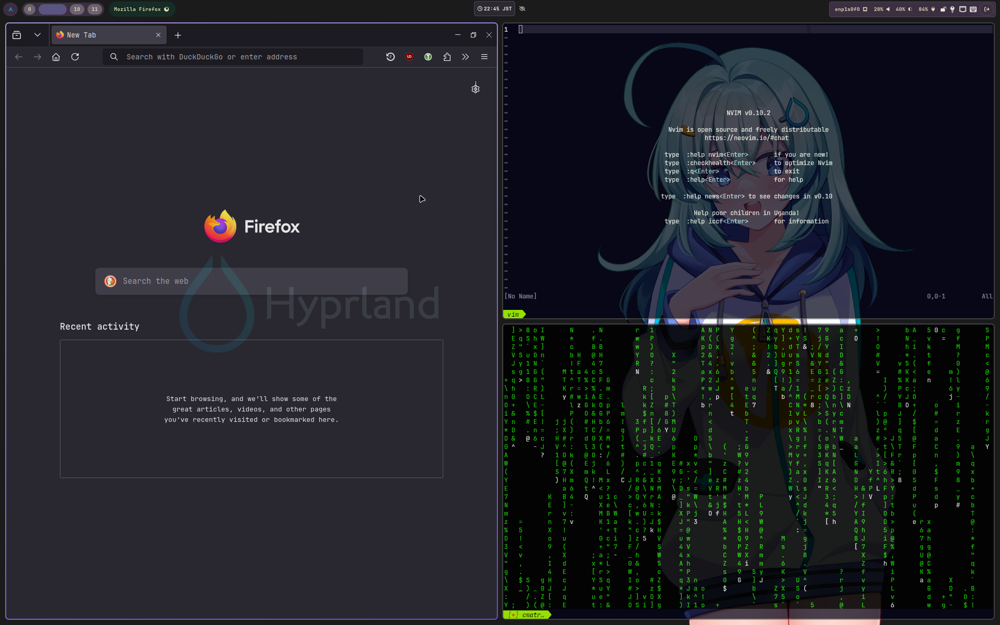

# DOTFILES

### What are Dotfils?
Dotfiles are configulation files used on Unix-like system like Linux. They are 
named with a dot (.) at the beginning of the filename, which indicate that they
are hidden from normal directory listings. This repository contains my personal
dotfiles.

### 💾 Overview
- **Window Manager** : [Hyprland](https://github.com/hyprwm/Hyprland)
- **Operating System** : [Arch Linux](https://archlinux.org/)
- **Terminal** : [Kitty](https://sw.kovidgoyal.net/kitty/)
- **Editor** : [Neovim](https://neovim.io/https://neovim.io/)
- **Notification** : [Dunst](https://github.com/dunst-project/dunst)
- **Launcher** : [Rofi](https://github.com/davatorium/rofi)
- **File Manager** : [Ranger](https://github.com/ranger/ranger)

## 💻 Setup

## 

