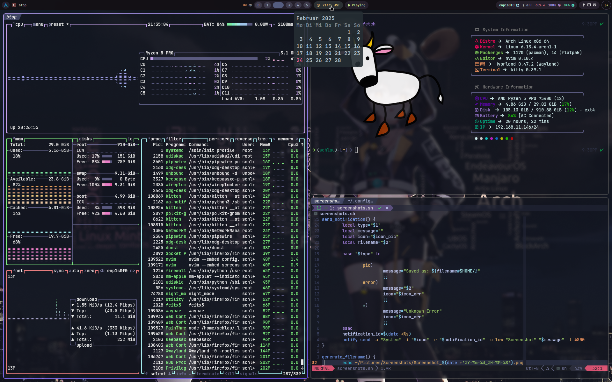

# DOTFILES

### What are Dotfils?
Dotfiles are configulation files used on Unix-like system like Linux. They are 
named with a dot (.) at the beginning of the filename, which indicate that they
are hidden from normal directory listings. This repository contains my personal
dotfiles.

